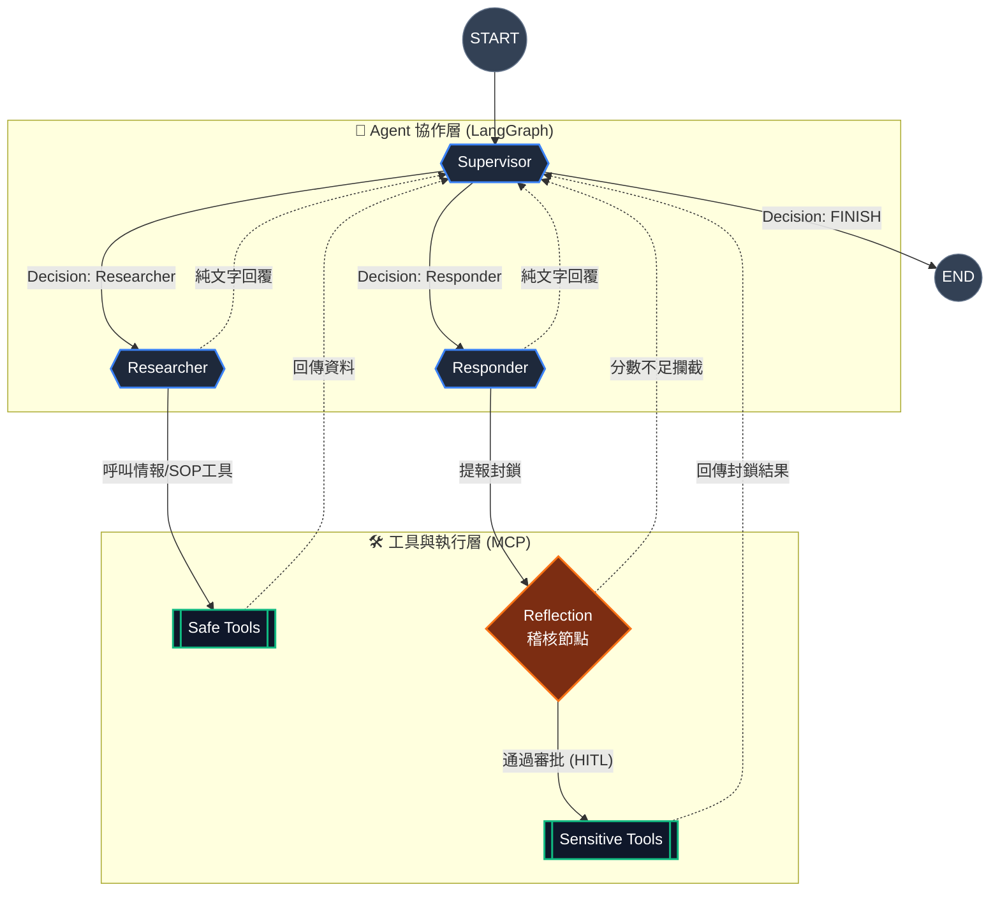

# AI Threat Hunter | 企業級自動化資安應變系統

這是一個基於 **LangGraph** 與 **MCP (Model Context Protocol)** 架構開發的自動化資安威脅評估系統。本專案模擬企業級 SOC（資安營運中心）的真實運作流程，結合 Multi-Agent 協作、混合檢索 (Hybrid RAG) 知識庫與動態風險評估引擎，並透過 **Human-in-the-Loop (HITL)** 機制確保自動化防禦的絕對合規性。

## 核心亮點 (Core Features)

- **Multi-Agent 協作架構 (Agentic Workflow)** 使用 LangGraph 構建具備嚴格狀態機 (State Machine) 的循環圖。系統分為三個核心 Agent：
  - **Supervisor**: 負責意圖識別、決策路由與最終報告統整，具備防搶答與強制交辦機制。
  - **Researcher**: 專職情報收集與 SOP 規範檢索，嚴格受限於 Grounding 原則，禁止幻覺 (Hallucination)。
  - **Responder**: 專職敏感操作執行，觸發封鎖程序。
  
- **Hybrid Search RAG** 摒棄單一向量檢索的缺陷，實作 `EnsembleRetriever`。結合 **FAISS (Dense/語意理解)** 與 **BM25 (Sparse/關鍵字精準比對)**，完美解決資安 SOP 中大量專有名詞與層級條件的「上下文錯位」問題。

- **動態風險評估引擎 (Dynamic Risk Scoring)** 結合本地 SQLite 資料庫與外部 Geo-IP 服務，建立風險評分機制。當 IP 觸發特定條件（如來自高風險國家、使用特定 ISP、累積偵測次數）時，動態增減 Risk Score。

- **Human-in-the-Loop, HITL** 針對防火牆封鎖 (`block_ip_tool`) 等敏感決策，實作 LangGraph 的中斷機制 (`interrupt_before`)。當 AI 決策封鎖時，流程將暫停並向前端發出審批請求，需人類分析師點擊「授權」方可寫入黑名單。

- **MCP 架構解耦設計** 採用 Model Context Protocol，將資安工具（Geo-IP 查詢、SQLite 資料庫讀寫）解耦為獨立的 FastMCP Server。System Prompt 抽離為獨立 Markdown 檔案，支援多 LLM 無縫切換（Groq / Gemini / Ollama）。

- **實時聊天室控制台 (Vue 3 Frontend)** 現代化前端介面，不僅提供即時對話，更能一鍵展開 Agent 的「思考過程 (Thought Process)」。右側具備動態排序的風險觀察名單 (Observation List) 與防火牆黑名單 (Blacklist) 實時監控面板。

---

## 系統架構圖 (Architecture)
